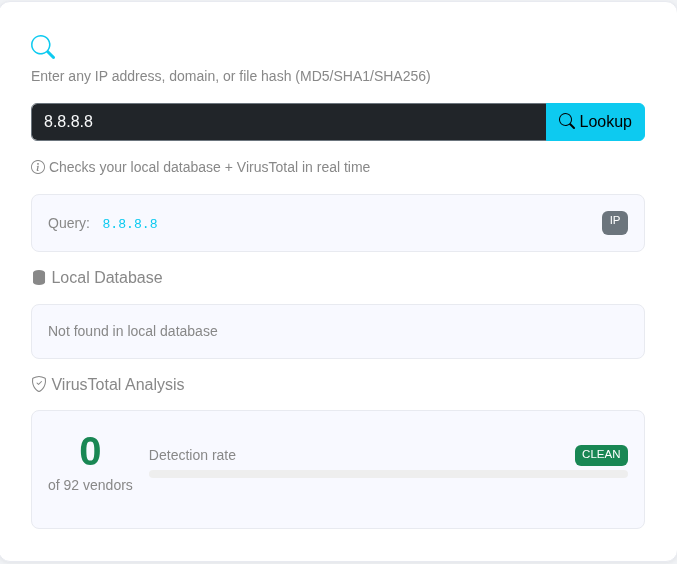
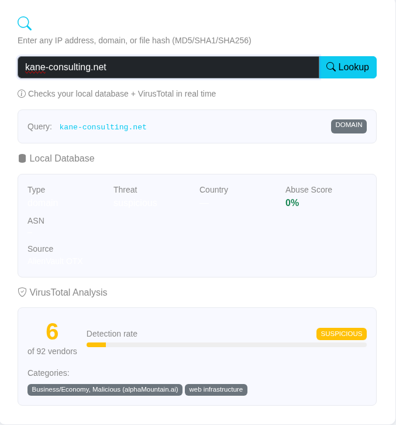
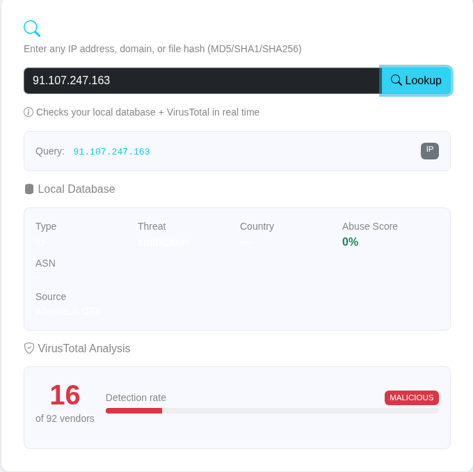

# ThreatIntel Dashboard

A web-based threat intelligence platform that aggregates, enriches, and correlates Indicators of Compromise (IOCs) from multiple open-source threat feeds in real time.

Built to simulate the kind of tooling used by SOC teams at MSSPs and enterprise security operations.


---

## What it does

Security teams need to know which IP addresses, domains, and files are being used by attackers — before those attackers reach their network. This tool automates that process:

1. **Ingests** live IOCs from AlienVault OTX threat feed
2. **Enriches** each IP with abuse confidence scores and geolocation
3. **Correlates** indicators seen across multiple threat reports
4. **Scores** each IOC with a confidence rating (LOW / MEDIUM / HIGH / CRITICAL)
5. **Displays** everything on a live dashboard with charts and search
6. **Refreshes** automatically every 60 minutes via background scheduler

---

## Screenshots

### Dashboard


### IOC Table


### Threat Lookup




---

## Features

- **Live IOC ingestion** from AlienVault OTX (malicious IPs, domains, file hashes)
- **IP enrichment** via AbuseIPDB — abuse confidence score 0–100%
- **Geolocation** via ip-api.com — country, city, ASN, ISP
- **Hash/IP/domain lookup** via VirusTotal — vendor detection count and threat names
- **Correlation engine** — confidence scoring across pulse count, abuse score, and threat type
- **Severity classification** — CRITICAL / HIGH / MEDIUM / LOW per IOC
- **Auto-scheduler** — background refresh every 60 minutes via APScheduler
- **Search and filter** — live filter by indicator, type, threat category, country
- **Sortable IOC table** — click any column header to sort
- **Timestamped logging** — all activity logged to `logs/` directory
- **Input validation** — all lookup queries sanitized before processing

---

## Tech Stack

| Layer | Technology |
|---|---|
| Backend | Python 3, Flask |
| Database | SQLite (via stdlib sqlite3) |
| Scheduler | APScheduler |
| Threat Feeds | AlienVault OTX API |
| Enrichment | AbuseIPDB API, ip-api.com |
| Lookup | VirusTotal API v3 |
| Frontend | Bootstrap 5, Chart.js, Jinja2 |
| Logging | Python logging module |

---

## Architecture

```
AlienVault OTX (threat feed)
↓
collectors/otx_collector.py
↓
database/db.py → threat_intel.db (SQLite)
↓
collectors/abuseipdb.py (IP enrichment)
↓
correlator/ioc_correlator.py (confidence scoring)
↓
scheduler.py (auto-refresh every 60 min)
↓
app.py (Flask web server)
↓
Browser → Dashboard / IOC Table / Lookup
```

---

## Project Structure

```
threat-intel-dashboard/
├── app.py                    # Flask routes and app entry point
├── config.py                 # API keys and settings (loaded from .env)
├── scheduler.py              # Background refresh scheduler
├── requirements.txt
├── .env.example              # Template for API keys
├── collectors/
│   ├── otx_collector.py      # AlienVault OTX feed ingestion
│   ├── abuseipdb.py          # IP reputation enrichment
│   └── virustotal.py         # Hash/IP/domain lookup
├── correlator/
│   └── ioc_correlator.py     # Confidence scoring and correlation
├── database/
│   ├── models.py             # SQLite table schema
│   └── db.py                 # All database operations
├── utils/
│   └── logger.py             # Timestamped logging setup
├── templates/
│   ├── base.html             # Shared navbar and layout
│   ├── dashboard.html        # Main dashboard with charts
│   ├── ioc_table.html        # Full sortable IOC table
│   └── lookup.html           # IOC search and VirusTotal lookup
├── static/
│   └── style.css             # Custom light theme styles
└── screenshots/              # Project screenshots for README
```

---

## Setup

### 1. Clone the repository

```bash
git clone https://github.com/m-arsalaan/threat-intel-dashboard.git
cd threat-intel-dashboard
```

### 2. Install dependencies

```bash
pip install -r requirements.txt
```

### 3. Get your free API keys

| API | Sign up | Free tier |
|---|---|---|
| AlienVault OTX | https://otx.alienvault.com | Unlimited |
| AbuseIPDB | https://www.abuseipdb.com | 1,000 checks/day |
| VirusTotal | https://www.virustotal.com | 500 requests/day |

### 4. Configure environment

```bash
cp .env.example .env
nano .env
```

Fill in your keys:

```
OTX_API_KEY=your_key_here
ABUSEIPDB_API_KEY=your_key_here
VIRUSTOTAL_API_KEY=your_key_here
```

### 5. Run the application

```bash
python3 app.py
```

Open your browser at `http://127.0.0.1:5000`

---

## Usage

### Dashboard
The main page shows live stats — total IOCs, high confidence threats, correlated indicators, and malicious IPs. Two charts display threat categories and IOC type distribution.

### IOC Table
Full table of all collected indicators. Filter by type (IP/domain/hash) or threat category. Click any column header to sort. Click the search icon on any row to run a lookup.

### Lookup
Enter any IP address, domain, or file hash (MD5/SHA1/SHA256). The tool checks your local database first, then queries VirusTotal in real time and returns vendor detection count, threat names, and severity rating.

---

## Example Lookups

```
Known malicious IP:        91.107.247.163
WannaCry ransomware hash:  84c82835a5d21bbcf75a61706d8ab549
Clean IP (Google DNS):     8.8.8.8
```

---

## Logging

All activity is logged with timestamps to `logs/threatintel_YYYY-MM-DD.log`:

```
2026-05-14 05:11:19 [INFO] Starting IOC collection from AlienVault OTX...
2026-05-14 05:11:22 [INFO] Found 10 threat pulses
2026-05-14 05:11:25 [INFO] Collection complete — 257 IOCs saved to database
2026-05-14 05:11:51 [INFO] Lookup query received: 91.107.247.163
```

---

## Future Improvements

- [ ] Docker + docker-compose for one-command deployment
- [ ] PDF export of IOC report
- [ ] User authentication for multi-user SOC environments
- [ ] Additional feeds — Abuse.ch, Emerging Threats, MISP
- [ ] MITRE ATT&CK TTP mapping per threat campaign
- [ ] Email alerts for critical IOC detection
- [ ] Redis caching to reduce API rate limit usage

---

## Author

**Muhammad Arslan**  
ISO/IEC 27001:2022 Lead Auditor | Cybersecurity Student, Air University  
[LinkedIn](https://linkedin.com/in/itzarslan4) | [GitHub](https://github.com/m-arsalaan)

---

## Disclaimer

This tool is built for educational and defensive security purposes only.  
All threat data is sourced from publicly available open-source intelligence feeds.
